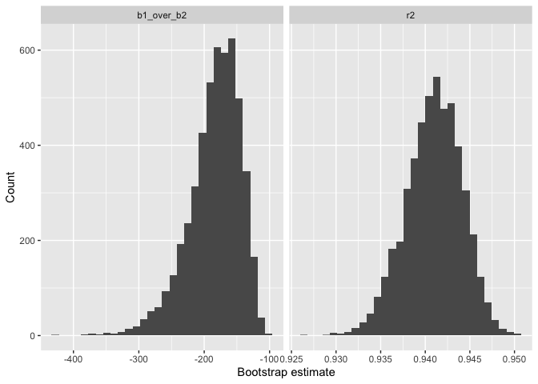
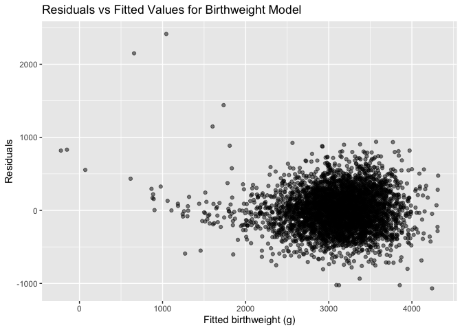

p8105_hw6_ng3005
================
Nelson Gaillard
2025-12-01

``` r
library(tidyverse)
```

    ## ── Attaching core tidyverse packages ──────────────────────── tidyverse 2.0.0 ──
    ## ✔ dplyr     1.1.4     ✔ readr     2.1.5
    ## ✔ forcats   1.0.0     ✔ stringr   1.5.1
    ## ✔ ggplot2   3.5.2     ✔ tibble    3.3.0
    ## ✔ lubridate 1.9.4     ✔ tidyr     1.3.1
    ## ✔ purrr     1.1.0     
    ## ── Conflicts ────────────────────────────────────────── tidyverse_conflicts() ──
    ## ✖ dplyr::filter() masks stats::filter()
    ## ✖ dplyr::lag()    masks stats::lag()
    ## ℹ Use the conflicted package (<http://conflicted.r-lib.org/>) to force all conflicts to become errors

``` r
library(p8105.datasets)
library(broom)

set.seed(1)
```

## Problem 2

``` r
data("weather_df")

boot_res =
  replicate(5000, {
    boot_dat = weather_df |> 
      sample_frac(replace = TRUE)
    
    fit = lm(tmax ~ tmin + prcp, data = boot_dat)
    
    r2 = glance(fit) |> 
      pull(r.squared)
    
    coefs = tidy(fit)
    
    b1 = coefs |> 
      filter(term == "tmin") |> 
      pull(estimate)
    
    b2 = coefs |> 
      filter(term == "prcp") |> 
      pull(estimate)
    
    ratio = b1 / b2
    
    c(r2 = r2, b1_over_b2 = ratio)
  })

boot_df = as_tibble(t(boot_res))

boot_df |> 
  pivot_longer(cols = everything(),
               names_to = "quantity",
               values_to = "value") |> 
  ggplot(aes(x = value)) +
  geom_histogram(bins = 30) +
  facet_wrap(~ quantity, scales = "free_x") +
  labs(x = "Bootstrap estimate", y = "Count")
```

<!-- -->

The distribution of the ratio of beta_1 to beta_2 appears to be
left-skewed and unimodal with a majority of the data concentrated closer
to the right side of the plot.

The distribution of r2 appears to be relatively symmetric and unimodal
with a median bootstrap estimate hovering between 0.940 and 0.945.

``` r
boot_df |> 
  summarize(
    r2_low = quantile(r2, 0.025), 
    r2_high = quantile(r2, 0.975),
    ratio_low = quantile(b1_over_b2, 0.025),
    ratio_high = quantile(b1_over_b2, 0.975)
  ) |> 
  knitr::kable(digits = 2)
```

| r2_low | r2_high | ratio_low | ratio_high |
|-------:|--------:|----------:|-----------:|
|   0.93 |    0.95 |   -279.75 |    -125.69 |

Based on the table, the 95% CI for the ratio of beta_1 to beta_2 is
(-281.31, -124.80). The 95% CI for r2 is (0.93, 0.95).

## Problem 3

``` r
birth_df =
  read_csv("data/birthweight.csv", na = c("NA", ".", "")) |> 
  janitor::clean_names() |> 
  mutate(
    babysex = as.factor(babysex),
    mrace = as.factor(mrace),
    frace = as.factor(frace),
    malform = as.factor(malform))
```

    ## Rows: 4342 Columns: 20
    ## ── Column specification ────────────────────────────────────────────────────────
    ## Delimiter: ","
    ## dbl (20): babysex, bhead, blength, bwt, delwt, fincome, frace, gaweeks, malf...
    ## 
    ## ℹ Use `spec()` to retrieve the full column specification for this data.
    ## ℹ Specify the column types or set `show_col_types = FALSE` to quiet this message.

``` r
main_model = lm(
  bwt ~ gaweeks + blength + bhead + ppbmi + wtgain + smoken + parity + babysex + mrace + fincome,
  data = birth_df)

birth_df |> 
  modelr::add_predictions(main_model) |> 
  modelr::add_residuals(main_model) |> 
  ggplot(aes(x = pred, y = resid)) +
  geom_point(alpha = 0.5) +
  labs(
    x = "Fitted birthweight (g)", 
    y = "Residuals", 
    title = "Residuals vs Fitted Values for Birthweight Model"
  )
```

<!-- -->

This model contains the outcome of interest, `bwt`, and the two
exposures of interest, `gaweeks` and `blength` in addition to various
relevant covariates–ones that clinically affect the outcome of interest.
It is important to adjust for these convariates in the hypothesized
model to avoid spurious associations due to confounding.

#### Comparison to additional models

``` r
cv_splits = modelr::crossv_mc(birth_df, n = 50)

main_effects =
  lm(bwt ~ blength + gaweeks, data = birth_df)

interaction = 
  lm(bwt ~ bhead * blength * babysex, data = birth_df)

cv_splits |> 
  mutate(
    fit_main = map(train, ~ lm(main_model, data = as_tibble(.x))),
    fit_main_effects = map(train, ~ lm(main_effects, data = as_tibble(.x))),
    fit_int = map(train, ~ lm(interaction, data = as_tibble(.x))),
    
    rmse_main = map2_dbl(fit_main, test, ~ {
      test_df = as_tibble(.y)
      preds = predict(.x, newdata = test_df)
      truth = test_df |> pull(bwt)
      sqrt(mean((preds - truth)^2))
    }),
    
    rmse_main_effects = map2_dbl(fit_main_effects, test, ~ {
      test_df = as_tibble(.y)
      preds = predict (.x, newdata = test_df)
      truth = test_df |> pull(bwt)
      sqrt(mean((preds - truth)^2))
    }),
    
    rmse_interaction = map2_dbl(fit_int, test, ~ {
      test_df = as_tibble(.y)
      preds = predict(.x, newdata = test_df)
      truth = test_df |> pull(bwt)
      sqrt(mean((preds - truth)^2))
    })
  ) |> 
  
  summarize(
    mean(rmse_main),
    mean(rmse_main_effects),
    mean(rmse_interaction)
  ) |> 
  pivot_longer(
    everything(),
    names_to = "model",
    values_to = "mean_rmse"
  ) |> 
  knitr::kable()
```

    ## Warning: There was 1 warning in `mutate()`.
    ## ℹ In argument: `rmse_main = map2_dbl(...)`.
    ## Caused by warning in `predict.lm()`:
    ## ! prediction from rank-deficient fit; attr(*, "non-estim") has doubtful cases

| model                   | mean_rmse |
|:------------------------|----------:|
| mean(rmse_main)         |  275.4493 |
| mean(rmse_main_effects) |  331.6955 |
| mean(rmse_interaction)  |  289.9337 |

This table shows the `mean_rmse` for each of the three models we’re
comparing–`main_model`, `main_effects`, and `interaction`. Based on the
analysis, `main_model` has the lowest mean rmse, meaning this model’s
predictions are closest to the true birthweight compared to the other
models. On the other hand, `main_effects`, the model containing only the
variables `gaweek` and `blength`, has the greatest rmse. This indicates
that this model does not fit the data as well as the other two. For
`interaction`, mean rmse decreased notably, but not to the same extent
as `main_model` which adjusts for numerous covariates.
